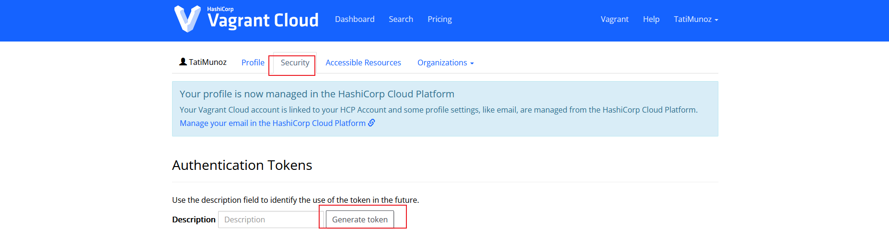

### ¿Qué es Vagrant?
- Es una herramienta para crear y administrar maquinas virtuales o ambientes de estas
- Se crean en tu maquina local o dentro de un provider
- Puede utilizar shell scripts, Chef o Puppet
- Algunos providers:
	-  VirtualBox
	- Docker
	- HyperV
Incluso se puede usar custom providers


### ¿Para que o Por que Vagrant?

Generalmente yo lo uso para levantar ambientes de prueba locales, ya que suelo trabajar en nube,  pero hay trabajos que requieren conocimiento de virtualización, Vagrant puede ayudar al aprovisionamiento rápido y automatización 

- ✨**Mi caso de trabajo✨**
    
    Tuvimos que realizar un trabajo practico que involucraba Jenkins, Docker y varias maquinas virtuales, ya que era de forma local.  Decidimos trabajar con Windows, lo cual genera complicaciones al momento de compatibilidad por lo que levantamos una maquina virtual. 
    
    - **Primer problema:** ¿Cómo trabajar a la par cada uno por su lado, si no teníamos un mismo ambiente?
    - **Segundo problema:** La necesidad de software especifico con versiones especificas, y la falta de experiencia del equipo
    
    **Solucion:** 
    
    - Fase 1: Trabajamos con un mismo vagrantfile, el cual nos permitió tener el mismo ambiente base, y estar todos en el mismo punto de partida
    - Fase 2: Cada cambio que uno hacia en su local, (prueba y testeo) no se replicaba, por lo que teníamos que compartirnos el mismo file. Por lo que optamos por subir nuestro vagrantfile a la nube de Vagrant para mas accesibilidad para el equipo
 Es fácil de configurar, reproducir y portable.


| **Herramienta** | **Propósito Principal**                                  | **Por qué usar Vagrant en su lugar**                                             |
|-----------------|----------------------------------------------------------|----------------------------------------------------------------------------------|
| **Vagrant**     | Administración de entornos de desarrollo completos.       | Ideal para levantar entornos completos con un SO dedicado, útil para desarrollo local y testing. |
| **Docker**      | Contenerización de aplicaciones en entornos ligeros.      | Si necesitas un entorno de desarrollo completo con SO, no solo ejecutar contenedores.             |
| **CLI Tools**   | Automatización de tareas y gestión de sistemas.           | Para crear y gestionar entornos de desarrollo completos, no solo automatizar tareas puntuales.    |
| **Terraform**   | Construcción y gestión de infraestructura como código.    | Si necesitas un entorno local de desarrollo con características específicas, no solo gestionar infra. |


###  Comandos Importantes

Inicializa el directorio actual para crear un ambiente de Vagrant creando un vagrantfile
```
vagrant init 
```

 Crea y configura la maquina virtual siguiendo el vagrantfile
```
vagrant up
```
Detiene y destruye todo los recursos creados
```
vagrant destroy 
```
Chequea la sintaxis del vagrantfile:
```
vagrant validate 
```
Lo corre en los providers configurados
```
vagrant provision
```
Detiene y vuelve a levantar
```
vagrant reload 
```
Te dice el estado de tus maquinas 
```
vagrant status 
```
Te conectas pos ssh a la maquina que se haya levantando en el directorio donde esta el vagrantfile
```
vagrant ssh 
```


### Creacion con Vagrant Docker Provider

1. Crearemos el vagrantfile por comando y la "-m" significa minimal, es decir, sin los comentarios base que genera 
```
vagrant init -m
```

2. Cambiamos el vagrant para que use de provider Docker

```
Vagrant.configure("2") do |config|
  config.vm.provider "docker" do |d|
    d.image = "ghost"
    d.env = {
      "database__client" => "sqlite3",
      "database__connection__filename" => "/var/lib/ghost/content/data/ghost.db"
    }
  end
end
```

3. Iniciamos vagrant

~~~
vagrant up --provider-docker
~~~

4. Podemos hacer vagrant destroy -f y no veremos mas el contenedor como si utilizaramos docker


### VagrantFile

Usa una sintaxis en Ruby, no hace falta ser un experto en Ruby pero entenderlo 

~~~
Vagrant.configure("2") do |config|
  config.vm.provider "docker" do |d|
  d.image = "ghost"
	d.ports = ["80:2368"]
	end
end
~~~

- [config.vm.](http://config.vm.box)provider = esto indica el provider
- d.image = va ser a la imagen docker
- d.ports: el puerto 80 del contenedor mapeado al 2368 de tu local

Generalmente busca el vagrantfile mas cercano al path donde ejecutemos vagrant up en una jerarquia de arbol invertido 

~~~
Vagrant.configure("2") do |config|
  config.vm.box = "ubuntu/trusty64"
	config.vm.synced_folder = "." ,"./vagrant"
end
~~~

- config.vm box = indicamos el box con la imagen que vamos a usar
- config.vm.synced = indicamos la carpeta que se sincroniza en el local (.) con la carpeta dentro de vagrant (./vagrant) machine

### Acceder a maquinas Vagrant

Podemos ingresar por SSH si vemos al hacer vagrant up una linea que diga SSH Address

```jsx
ssh vagrant@localhost -p 2222 -i /.vagrant.d/insecure_private_key

·PASSWORD SERA vagrant
```

Tambien podemos ingresar con 

```jsx
vagrant ssh-config
```

Nos da la informacion del ssh para conectarnos, osea el config del sshd 

Pero como podemos definir y conectarnos a multiples machines?


### Definir muchas maquinas Vagrant

~~~
Vagrant.configure("2") do |config|
	config.vm.define "web" do |web|
		web.vm.box = "ubuntu/trusty64"
	end
	
	config.vm.define "db" do |db|
		db.vm.box = "ubuntu/trusty64"
	end 
~~~

Tenemos dos maquinas ahi, una para web y otra para db pero ambas con ubuntu 


---

## Vagrant CLI

Estos pasos son para setear Vagrant CLI, ya que los pasos en la documentación oficial esta deprecado (Proximamente deprecado)

### Requisitos

- Instalado Vagrant
- Cuenta en Vagrant Cloud


1. Vamos a ejecutar el login con:
~~~
vagrant cloud auth login --token {TOKEN}
~~~

Este token lo conseguiremos en https://app.vagrantup.com/settings/security


Algunos comandos que pueden ser de ayuda:
~~~
vagrant cloud auth whoami

vagrant cloud auth logout
~~~


---
##  Vagrant Boxes

En lugar de crear desde 0 una maquina, podes tener imágenes bases, conocidas como “boxes” en vagrant y especificarle la box que quieres usar


### Instalar Box
~~~
vagrant box add hashicorpt/bionic64

vagrant box add tatiMunoz/pin1 #POR EJEMPLO
~~~

El catalogo de boxes en [Vagrant Cloud,](https://vagrantcloud.com/boxes/search) tiene su propio catalogo

Una vez agregado, vas a tener estas bases localmente, es decir, como base para usarlas cuando quieras

~~~
vagrant box list
~~~

### Utilizar Box

~~~
vagrant init TatiMunoz/Microk8s
~~~

Esto da como resultado un mensaje de confirmacion, luego de eso nos genera un vagranfile en el directorio

Como opción, podemos abrir el vagrantfile que se genero y cambiar lo que queremos
```
Vagrant.configure("2") do |config|
  config.vm.box = "hashicorp/bionic64"
  config.vm.box_url = "https://vagrantcloud.com/hashicorp/bionic64"
end
```

Iniciamos el ambiente, usaremos este comando posicionados en la misma carpeta del vagrantfile (ya sea creado dede 0 o descargado del box)

```
vagrant up
```

Para conectarnos a la maquina parados en la misma ruta:


```
vagrant ssh
```
Casi siempre vamos a tener el usuario vagrant con contraseña vagrant (Si es que queremos conectarnos por Virtualbox directamente)

Para remover el box:

```
vagrant box remove TatiMunoz/PIN1
```


En lugar de crear desde 0 una maquina, podes tener imágenes bases, conocidas como “boxes” en vagrant y especificarle la box que quieres usar

- Instalar Box

```powershell
vagrant box add hashicorpt/bionic64

vagrant box add tatiMunoz/pin1 #POR EJEMPLO
```

El catalogo de boxes en [Vagrant Cloud,](https://vagrantcloud.com/boxes/search) tiene su propio catalogo

Una vez agregado, vas a tener estas bases localmente, es decir, como base para usarlas cuando quieras

```powershell
vagrant box list
```

- **Usar Box**

Primero haremos

```sql
vagrant init TatiMunoz/Microk8s
```

Esto da como resultado un mensaje de confirmacion, luego de eso nos genera un vagranfile en el directorio

Como opción, podemos abrir el vagrantfile que se genero y cambiar lo que queremos 

```powershell
Vagrant.configure("2") do |config|
  config.vm.box = "hashicorp/bionic64"
  config.vm.box_url = "https://vagrantcloud.com/hashicorp/bionic64"
end
```

- **Iniciar ambiente**

Usaremos este comando, estando posicionados en la misma carpeta donde esta el vagrantfile, (ya sea creado desde 0, o descargado desde box)

```powershell
vagrant up
```

- **Conectarnos a la maquina**

Para conectarnos a nuestra maquina creada

```powershell
vagrant ssh
```

Casi siempre vamos a tener el usuario vagrant con contraseña vagrant (Si es que queremos conectarnos por Virtualbox directamente)

- **Remover de box**

```powershell
vagrant box remove tatiMunoz/PIN1
```

Esto borrara de la lista de boxes “locales” nuestra box

### Sincronización de archivos

Al iniciar una maquina vagrant, se genera una carpeta “.vagrant” en el directorio donde estamos, esta carpeta esta sincronizada con la maquina

Todo lo que vaya dentro de ella se vera reflejada en “/vagrant/” dentro de la maquina virtual

### Publicacion de Boxes Locales 

> 📝**NOTA:** Para poblicar primero debemos loguearnos a HCP Cloud desde la consola 


Primero, creamos la box

```ruby
vagrant package --base Vagrant_default_1698290377215_88 --output Microk8s.box
```

- Vagrant_default: Es la maquina virtual que yo levante y estuve usando (Debe estar apagada)
- [Microk8s.box](https://app.vagrantup.com/TatiMunoz/boxes/Microk8s) es el nombre que quiero que tenga

Luego,  para subir a la nube usaremos este comando


```
vagrant cloud publish tatiMunoz/Microk8s 1.0.0 virtualbox Microk8s.box -d "A really cool box to download and use" --version-description "A cool version" --release --short-description "Download me!"
```