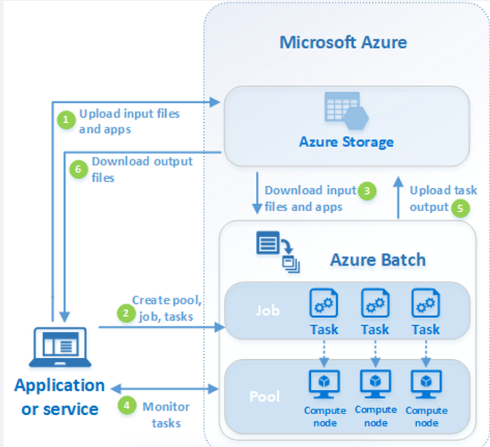

## <mark style="background: #FFB8EBA6;">¿Que es?</mark> 💭
Es un servicio de Azure que permite crear y administrar nodos (vm's).  Esta diseñada para ejecutar aplicaciones a gran escala (generalmente, render o procesamiento de videos )  Basicamente funciona como un SaaS

## <mark style="background: #FFB8EBA6;">Componentes</mark>
- **Cuenta Batch**: Es el servicio donde se van a configurar los recursos que se van a utilizar, por ej, nodos y jobs
- **Grupos de nodos**: Son VM's que ejecutan las tareas, se puede configurar el tamaño y el computo
- **Jobs**: Es una coleccion de tareas
- **Almacenamiento**: Es el azure storage para almacenar los datos necesarios para las tareas o el input que genera 

## <mark style="background: #FFB8EBA6;">Pasos:</mark>

| Paso                                                                                                                                                                    | Descripción                                                                                                                                                                                                                                                                                                                                                                                                                                                                                                                                                                                                                                                                                                                                                                                                                                                                                                                                                                      |
| ----------------------------------------------------------------------------------------------------------------------------------------------------------------------- | -------------------------------------------------------------------------------------------------------------------------------------------------------------------------------------------------------------------------------------------------------------------------------------------------------------------------------------------------------------------------------------------------------------------------------------------------------------------------------------------------------------------------------------------------------------------------------------------------------------------------------------------------------------------------------------------------------------------------------------------------------------------------------------------------------------------------------------------------------------------------------------------------------------------------------------------------------------------------------- |
| 1. Cargue los **archivos de entrada** y las **aplicaciones** que los procesarán en su cuenta de Azure Storage.                                                          | Los archivos de entrada pueden ser cualquier dato que vaya a procesar la aplicación, como diseños de modelos financieros, o archivos de vídeo que se van a transcodificar. Los archivos de aplicación pueden incluir scripts o aplicaciones que procesen datos, como un transcodificador multimedia.                                                                                                                                                                                                                                                                                                                                                                                                                                                                                                                                                                                                                                                                             |
| 2. Cree un **grupo** de Batch de nodos de proceso en la cuenta de Batch, un **trabajo** para que ejecute la carga de trabajo en el grupo y **tareas** para ese trabajo. | Los [nodos de grupo](https://learn.microsoft.com/es-es/azure/batch/nodes-and-pools) son las máquinas virtuales que ejecutan las [tareas](https://learn.microsoft.com/es-es/azure/batch/jobs-and-tasks). Especifique propiedades como el número y el tamaño de los nodos para el grupo, una imagen de máquina virtual Windows o Linux, y la aplicación que desea instalar cuando se unan los nodos al grupo. Administre el costo y el tamaño del grupo mediante [máquinas virtuales de acceso puntual de Azure](https://learn.microsoft.com/es-es/azure/batch/batch-spot-vms) o con el [escalado automático](https://learn.microsoft.com/es-es/azure/batch/batch-automatic-scaling) del número de nodos si la carga de trabajo cambia.      Al agregar tareas a un trabajo, el servicio Batch programa automáticamente las tareas para su ejecución en los nodos de proceso en el grupo. Cada tarea usa la aplicación que ha cargado para procesar los archivos de entrada. |
| 3. Descargue los **archivos de entrada** y las **aplicaciones** en Batch                                                                                                | Antes de que cada tarea se ejecute, esta puede descargar los datos de entrada que va a procesar en el nodo al que está asignada. Si la aplicación no está ya instalada en los nodos de proceso, se puede descargar aquí. Cuando las descargas de Azure Storage se completan, la tarea se ejecuta en el nodo asignado.                                                                                                                                                                                                                                                                                                                                                                                                                                                                                                                                                                                                                                                            |
| 4. Supervise la **ejecución de las tareas**                                                                                                                             | Mientras se ejecutan las tareas, puede solicitar a Batch que supervise el progreso del trabajo y sus tareas. Un servicio o una aplicación cliente se comunican con el servicio Batch a través de HTTPS. Dado que puede que supervise miles de tareas que se ejecutan en miles de nodos de proceso, asegúrese de [consultar el servicio Batch de forma eficaz](https://learn.microsoft.com/es-es/azure/batch/batch-efficient-list-queries).                                                                                                                                                                                                                                                                                                                                                                                                                                                                                                                                       |
| 5. Cargue la **salida de la tarea**                                                                                                                                     | Cuando se completan las tareas, estas cargan los datos de sus resultados en Azure Storage. Los archivos también se pueden recuperar directamente del sistema de archivos de un nodo de proceso.                                                                                                                                                                                                                                                                                                                                                                                                                                                                                                                                                                                                                                                                                                                                                                                  |
| 6. Descargue los **archivos de salida**                                                                                                                                 | Cuando la supervisión detecta que se han completado las tareas en su trabajo, el servicio o la aplicación de cliente puede descargar los datos de salida para su posterior procesamiento.                                                                                                                                                                                                                                                                                                                                                                                                                                                                                                                                                                                                                                                                                                                                                                                        |

## <mark style="background: #FFB8EBA6;">Preguntas </mark>

### ¿Las maquinas que levanta son VM's como recursos?
Si y no. No se crean como un recursos como tal que se puede ver en la cuenta de Azure pero comparte algunas cosas
Cuando creas el pool, definis el numero de nodos de computo (VM) pero se gestiona internamente, Azure Batch se encarga de la creacion, escalado y eliminacion de VM's dentro del pool, se asignan automaticamente segun la demanda.
IGUALMENTE, Azure nos genera costos por tiempo de actividad y tamaño 

### ¿Se puede programar tareas?
Si, nos provee la opcion de "no ejecutar cuando" o " hasta cuando" tambien permite opciones de monitoreo con Azure Monitor o integracion con Azure Data Factory entre otros servicios

