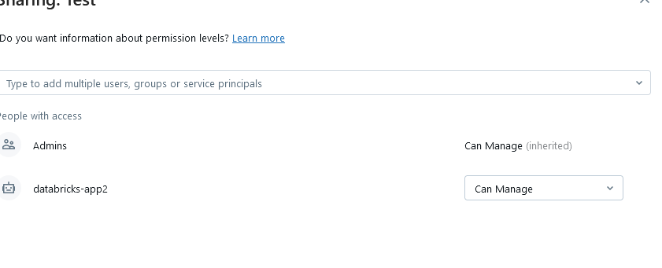

## Por que deberiamos conectarlo contra Azure Devops?

Si quisieramos pasar de ambientes automaticamente, sin dejar asociado ningun nombre de un usuario como owner de los archivos, deberiamos realizar la conexion contra Azure DevOps.

### Requisitos:

- Databricks Instance
- Service Principal
- Self Hosted or Azure Hosted

### Pruebas en Postman:

Sirve para probar manualmente, pero los tokens expiran en cortos plazos.

[Pruebas en Postman](https://www.postman.com/mission-participant-26477422/workspace/databricks/collection/34475567-12da3afe-034f-4c48-a506-bd8277edfd7f)

---

En este proceso vamos a tener que utilizar varios tokens para poder hacer un "Update Repo" (Basicamente updatear los archivos del repositorio de AzureDevOps hacia cualquier Databricks) en nombre de una app registration en la carpeta de Repos/ y no en la carpeta de Shared ni en una personal como suele suceder si copiamos manualmente utilizando el usuario)

Primero haremos login con nuestra app registration, como ven, requiere tener un secret value:

~~~YAML
 az login --service-principal -u $(client_id) -p $(client_pass) --tenant $(AZURE-TENANT-ID)
 ~~~

 Luego obtendremos varios tokens:
 - AD Token: Del Azure Portal
 - ADO Token: De AzureDevOps (Mejor conocido como PAT o Personal Access Token)
 - Databricks Token: Necesario para poder interactuar con la API de Databricks

## Permisos 

> 📝 **NOTA:** **Es necesario que nuestra app registration tenga permisos de Cluster Creation y de Service Manager dentro de nuestro Databricks, esto se hace desde adentro del Databricks en Settings**
> 📝 **NOTA 2:** **Es necesario que tenga permisos en el REPO ya sea parte de un grupo pero que pueda Administrar repositorio**
>
>

> 📝 **NOTA 3:** **Es necesario que la app registration sea agregado como usuario en la organizacion de Azure DevOps**
> 

A continuacion va el pipeline que estuve utilizando para realizar pruebas: 

~~~YAML
-# Starter pipeline
# Start with a minimal pipeline that you can customize to build and deploy your code.
# Add steps that build, run tests, deploy, and more:
# https://aka.ms/yaml

trigger:
- main

pool:
  vmImage: 'ubuntu-latest'

variables:
 - group: Databricks

steps:

- bash: |
   python3 -m pip install --upgrade pip
   python3 -m pip install msal
   python3 -m pip install databricks_cli
  displayName: '2. Install modules Python'

#We need to login as the service principal in order to obtain the token for the required services
- bash: |
    az login --service-principal -u $(AUTH_CLIENT_ID) -p $(AUTH_CLIENT_PASS) --tenant $(AUTH_AZURE_TENANT_ID)
  displayName: '3. Az Login as service principal'

##-----------------------------------------------------------------------------------------##
##-----------------------------------------------------------------------------------------##
##-----------------------------------------------------------------------------------------##

#In this step, we obtain the token for AAD 
- bash: |
   response_aad=$(curl --location --request POST 'https://login.microsoftonline.com/$(AUTH_AZURE_TENANT_ID)/oauth2/token' \
   --header 'Content-Type: application/x-www-form-urlencoded' \
   --header 'Cookie: x-ms-gateway-slice=estsfd; stsservicecookie=estsfd; fpc=AmbU18E-FeJDrvAnHAneXPxfCtJrAQAAAOju390OAAAAAg9H7QEAAAD47t_dDgAAAIeFAvEBAAAA-vHf3Q4AAAA' \
   --data-urlencode 'grant_type=client_credentials' \
   --data-urlencode 'client_id= $(AUTH_CLIENT_ID)' \
   --data-urlencode 'client_secret= $(AUTH_CLIENT_PASS)' \
   --data-urlencode 'resource= https://management.core.windows.net/')
       
   access_token=$(echo $response_aad | jq -r '.access_token')
   
   #This command is to pass variables through the pipeline in different stages 
   echo "##vso[task.setvariable variable=access_token]$access_token"
    
  displayName: '4. Get-AAD-Token '

#Step to obtain Databricks token
- bash: |
   LOGIN_URL="https://login.microsoftonline.com/$(AUTH_AZURE_TENANT_ID)/oauth2/v2.0/token"
   
   response_data2=$(curl --location --request POST "$LOGIN_URL" \
   --header 'Content-Type: application/x-www-form-urlencoded' \
   --header 'Cookie: x-ms-gateway-slice=estsfd; stsservicecookie=estsfd; fpc=AmbU18E-FeJDrvAnHAneXPxfCtJrAQAAAOju390OAAAA' \
   --data-urlencode "grant_type=client_credentials" \
   --data-urlencode "client_id= $(AUTH_CLIENT_ID)" \
   --data-urlencode "client_secret= $(AUTH_CLIENT_PASS)" \
   --data-urlencode "scope= 2ff814a6-3304-4ab8-85cb-cd0e6f879c1d/.default")
   
   token_data=$(echo "$response_data2" | jq -r '.access_token')
   
   echo "##vso[task.setvariable variable=token_data]$token_data"
  displayName: '5. Token_Data'

#Step to obtain Azure DevOps token (PAT, personal access token)
- bash: |
   LOGIN_URL="https://login.microsoftonline.com/$(AUTH_AZURE_TENANT_ID)/oauth2/v2.0/token"
   
   # Make POST request to get access token
   response_ado=$(curl --location --request POST "$LOGIN_URL" \
   --header 'Content-Type: application/x-www-form-urlencoded' \
   --header 'Cookie: x-ms-gateway-slice=estsfd; stsservicecookie=estsfd; fpc=AmbU18E-FeJDrvAnHAneXPxfCtJrAQAAAOju390OAAAA' \
   --data-urlencode "grant_type=client_credentials" \
   --data-urlencode "client_id= $(AUTH_CLIENT_ID)" \
   --data-urlencode "client_secret= $(AUTH_CLIENT_PASS)" \
   --data-urlencode "scope= 499b84ac-1321-427f-aa17-267ca6975798/.default")
   
   # Extract access token from response
   token_ado=$(echo "$response_ado" | jq -r '.access_token')
   

   echo "##vso[task.setvariable variable=token_ado]$token_ado"
  displayName: '6. Token_ADO PAT'

######################################################################😄######################################################################
######################################################################
######################################################################
######################################################################

- task: Bash@3
  inputs:
    targetType: 'inline'
    script: |
      echo "Token Data: $(TOKEN_DATA)"
      echo "Token ADO: $(TOKEN_ADO)"
      echo "Token AAD: $(ACCESS_TOKEN)"

######################################################################
######################################################################
######################################################################
######################################################################
- task: Bash@3
  inputs:
    targetType: 'inline'
    script: |
      HEADERS=(-H "Authorization: Bearer ${TOKEN_DATA}" -H "Content-Type: application/json")
      URL="${AUTH_DATABRICKS_HOST}/api/2.0/git-credentials"
      curl -v "${HEADERS[@]}" -X POST "$URL" --data-raw '{
          "personal_access_token": "${TOKEN_ADO}",
          "git_provider": "azureDevOpsServices",
          "git_username": "databricks-app2"
      }'
  displayName: '6.1. Create Git Credential'

- task: Bash@3
  inputs:
    targetType: 'inline'
    script: |
      HEADERS=(-H "Authorization: Bearer ${TOKEN_DATA}" -H "Content-Type: application/json")
      URL="${AUTH_DATABRICKS_HOST}/api/2.0/git-credentials"
      curl -v "${HEADERS[@]}" -X GET "$URL" --data-raw '{
          "personal_access_token": "${TOKEN_ADO}",
          "git_provider": "azureDevOpsServices",
          "git_username": "databricks-app2"
      }'
  displayName: '6.1. Get Git Credential'

- bash: |
   HEADERS=(-H "Authorization: Bearer ${TOKEN_DATA}" -H "Content-Type: application/json")
   URL="${AUTH_DATABRICKS_HOST}/api/2.0/git-credentials/{REPO_ID}"
   
   response_update=$(curl --location --request PATCH "$URL" \
   --header "Authorization: Bearer $TOKEN_DATA" \
   --header "Content-Type: application/json" \
   --data-raw '{
     "personal_access_token": "$(TOKEN_ADO)",
     "git_username": "databricks-app2",
     "git_provider": "azureDevOpsServices"
   }' )
   echo "$response_update"
  displayName: '8. UpdateGitCredential'

- bash: |

   HEADERS=(-H "Authorization: Bearer ${TOKEN_DATA}" -H "Content-Type: application/json")
   curl -v "${HEADERS[@]}" -X GET "${AUTH_DATABRICKS_HOST}/api/2.0/permissions/repos/REPO_ID" 
  displayName: 'Get Repo Permissions'

- bash: |

   HEADERS=(-H "Authorization: Bearer ${TOKEN_DATA}" -H "Content-Type: application/json")
   curl -v "${HEADERS[@]}" -X GET "${AUTH_DATABRICKS_HOST}/api/2.0/permissions/repos/REPO_ID/permissionLevels" 
  displayName: 'Get Repo Permissions'

- bash: |
   HEADERS=(-H "Authorization: Bearer ${TOKEN_DATA}" -H "Content-Type: application/json")
   URL="${AUTH_DATABRICKS_HOST}/api/2.0/repos"
   
   response_update=$(curl --location --request POST "$URL" \
   --header "Authorization: Bearer $TOKEN_DATA" \
   --header "Content-Type: application/json" \
   --data-raw '{
     "branch": "main",
     "path": "/Repos/Test/Integration2",
     "provider": "azureDevOpsServices",
     "sparse_checkout": {
       "patterns": [
         "parent-folder/child-folder"
       ]
     },
     "url": "https://dev.azure.com/ORG/_git/REPO"
   }' )
   echo "$response_update"
  displayName: '8. Create Repo'

- bash: |
   HEADERS=(-H "Authorization: Bearer ${TOKEN_DATA}" -H "Content-Type: application/json")
   URL="${AUTH_DATABRICKS_HOST}/api/2.0/repos/{ID}}"
   
   response_update=$(curl --location --request PATCH "$URL" \
   --header "Authorization: Bearer $TOKEN_DATA" \
   --header "Content-Type: application/json" \
   --data-raw '{
     "branch": "Databricks_OriginalPipe"
   }' )
   echo "$response_update"
  displayName: '8. Update Repo'

- task: Bash@3
  inputs:
    targetType: 'inline'
    script: |
      HEADERS=(-H "Authorization: Bearer ${TOKEN_DATA}" -H "Content-Type: application/json")
      URL="${AUTH_DATABRICKS_HOST}/api/2.0/repos/{ID}"
      
      curl --location --request GET "$URL" \
      --header "Authorization: Bearer $TOKEN_DATA" \
      --header "Content-Type: application/json"
~~~

Mis variables utilizadas como grupo:
- AUTH_AZURE_TENANT_ID
- AUTH_CLIENT_ID
- AUTH_CLIENT_PASS
- AUTH_DATABRICKS_HOST

## Explicacion del pipeline:

1. Primero me logueo en nombre de las app registration
2. Obtengo 3 tokens:
   1. PAT Token (ADO): Para autenticar en azure devops
   2. Databricks Token (TOKEN_DATA): Para interactuar con databricks
   3. AAD Token (TOKEN_AAD): Para interactuar con todo lo que es azure portal

3. Estos tokens van a ir en diferentes requests ya que el pipeline le pega a las diferentes API's
   
  ### Databricks 

4. Databricks pide generar una git credential por usuario, se genera una unica vez y luego se actualiza en base a que repositorio vas a utilizar **(6.1. Create Git Credential)**
5. Obtengo el ID de la credencial para poder actualizarla **(6.1. Get Git Credential)**
6. Updateo la credencial usando esa ID **(8. UpdateGitCredential)**

Una vez hecho esto, podrias hacer un GET de **HOST-DATABRICKS/api/2.0/repos** para ver que repositorios estan creados
7. Get repo permissions, para ver quien tiene permisos sobre ese repo para hacer que
8. Create repo, genere un repositorio en la ruta que indique
9. Update repo, unicamente pide el nombre de la branch que se va a copiar dentro de databricks

# Logs

Create Git Credential:

(Aca me tiro error porque como dije solamente es una git credential por vez)

Get git Credential

Update Git Credential

Get repo permissions

Create repo (Ya existia ese repo creado anteriormente)

Update repo: Muestra a que commit envio hacia databricks
