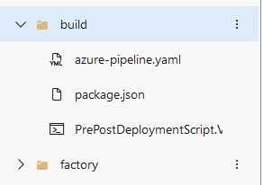
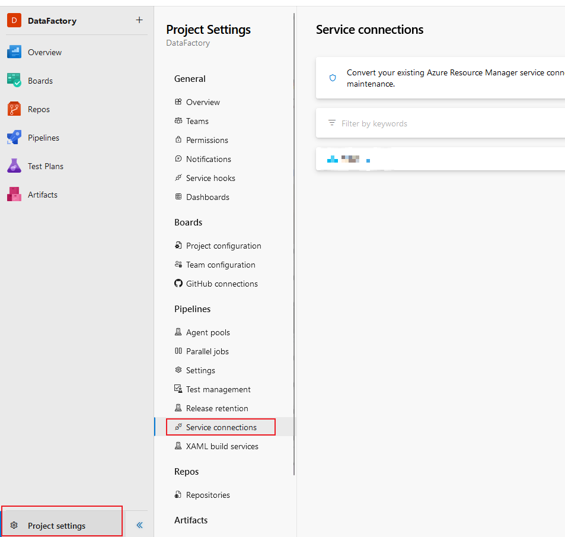
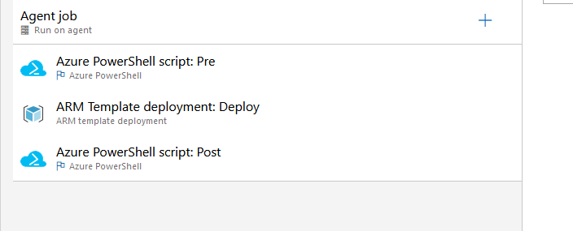

# ¿Qué es Data Factory?

Para tener una breve explicacion, ya que este post se trata de la conexion en si, Data Factory es como una central de distribucion de datos.

Imaginemos que es una gran ciudad, tiene diferentes fabricas alrededor de la ciudad (fuentes de datos) y cada fabrica produce diferentes tipos de productos (datos) que necesitan ser transportados a otras fabricas, tiendas o almacenes.

Data Factory seria el servicio de logistica que coordina y automatiza este transporte de productos (datos) desde las fabricas (origen de datos) hacia donde deban ir.

## ¿Por que necesito conectarlo a Azure DevOps?

En realidad, no es necesario. Pero, si brinda un esquema mas automatizado y permite no dar permisos de mas. 🤔 ¿A que se debe? 🤔

Bueno, para eso deberiamos ver como era el flujo anteriormente presentado.
### Flujo Tradicional 


En el flujo actual, el desarollador entra al ambiente de Data Factory y realiza los cambios que quiere, valida y realiza un Publish que se va a deployar automagicamente.

Esto requiere que el usuario que realice el Publish tenga permisos sobre los recursos en los cuales va a realizar cambios (Si los cambios del data factory estan conectados contra un azure storage, es necesario tener permisos sobre el Storage)

PERO EN EL NUEVO FLUJO... 🎉
### Nuevo flujo 


El desarollador, creara una rama en base a la main, donde realizara cambios, podra guardarlos y finalmente, crear un pull request hacia la main. Esto promptea una ventana en Azure DevOps para completar campos vacios del pull request. Una vez validado y aprobado, comienza el BUILD.

BUILD: Chequea la version de node, verifica los recursos en el Data Factory y genera un ARM Template

DEPLOY: Agarra lo que hay en tu pull request y compara con el ARM Template de lo que tenes actualmente, y hace los cambios para quedar acorde a la plantilla de los cambios. Agrega lo necesario y elimina lo que no esta 

# Laboratorio: Creacion de Conexion

Requisitos:
- App registration
- Cuenta de AzureDevOps (Con minutos libres o SelfHosted Agent)
- Repositorio en AzureDevOps
- DataFactory


1. Iremos a nuesto DataFactory Studio y dentro de el iremos a Configuracion > Git Configuration


2. Configuraremos en base a los pasos indicados en el portal 
3. Iremos a nuestro repositorio en AzureDevOps donde estara la configuracion de nuestro DataFactory y demas
4. Agregaremos una estructura de carpetas:



- Donde [PrePostDeploymentScript.Ver2.ps1](https://github.com/Azure/Azure-DataFactory/blob/main/SamplesV2/ContinuousIntegrationAndDelivery/PrePostDeploymentScript.Ver2.ps1)
- Donde el package.json:


```

{
    "scripts":{
        "build":"node node_modules/@microsoft/azure-data-factory-utilities/lib/index"
    },
    "dependencies":{
        "@microsoft/azure-data-factory-utilities":"^1.0.0"
    }
}
```


- Donde azure-pipeline.yaml sera:

~~~

trigger:
- main #Branch principal de colaboración

variables:
 - group: DataFactoryTest
 
pool:
  vmImage: 'ubuntu-latest'


steps:

- task: NodeTool@0
  inputs:
    versionSpec: '18.x'
  displayName: 'Install Node.js'

- task: Npm@1
  inputs:
    command: 'install'
    workingDir: '$(Build.Repository.LocalPath)/build' #Localizacion de la carpeta donde esta package.json
    verbose: true
  displayName: 'Install npm package'

- task: Npm@1
  inputs:
    command: 'custom'
    workingDir: '$(Build.Repository.LocalPath)/build' #Localizacion de la carpeta donde esta package.json
    customCommand: 'run build validate $(Build.Repository.LocalPath) /subscriptions/$(Subscription)/resourceGroups/$(ResourceGroup)/providers/Microsoft.DataFactory/factories/$(DataFactoryName)'
  displayName: 'Validate'

- task: Npm@1
  inputs:
    command: 'custom'
    workingDir: '$(Build.Repository.LocalPath)/build' #Localizacion de la carpeta donde esta package.json
    customCommand: 'run build export $(Build.Repository.LocalPath) /subscriptions/$(Subscription)/resourceGroups/$(ResourceGroup)/providers/Microsoft.DataFactory/factories/$(DataFactoryName) "ArmTemplate"'
  displayName: 'Validate and Generate ARM template'

- task: PublishPipelineArtifact@1
  inputs:
    targetPath: '$(Build.Repository.LocalPath)/build/ArmTemplate' #Localizacion de la carpeta donde esta package.json
    publishLocation: 'pipeline'
~~~

Donde *variables: group: DataFactoryTest* sera una libreria de variables en AzureDevOps


> **WARNING:** Es necesario realizar algun cambio en el DataFactory para poder correr este pipeline

5. Configuraremos el pipeline, yendo a Pipelines > Pipelines, donde crearemos uno nuevo basados en AzureRepos y elegiremos nuestra configuracion y al final, eligiremos el azure-pipelines.yaml

6. Realizaremos un pull request dentro del AzureDataFactory Studio y correra el pipeline automaticamente

7. Crearemos una Service Connection en la parte de Project Settings


8. Elegiremos Azure Resource Manager > Service Principal (Automatic)

9. Iremos ahora a Pipelines > Releases y crearemos un nuevo release (Empty Job)

    a. En la parte de Artifacts, vamos a elegir "Build" y en Source, elegiremos nuestro build pipeline configurado anteriormente

    b. En la parte de Stages, haremos click en "1 job 0 task" y haremos click en Agent Job

    c. Eligiremos Agent Pool = Windows - 2019 

    d. Agregaremos tareas en el boton de "+" las siguientes tareas:

    

    e. En Azure Powershell sera: (Chequear la opcion de *Use Powershell Core*)
    La ultima tarea de Azure Powershell tendra variables contrarias al pre: predeployment $false y -deleteDeployment $true

```
steps:
- task: AzurePowerShell@4
  displayName: 'Azure PowerShell script: Pre'
  inputs:
    azureSubscription: SERVICE CONNECTION
    ScriptPath: '$(System.DefaultWorkingDirectory)/BUILD/Job/PrePostDeploymentScript.ps1'
    ScriptArguments: '-armTemplate "$(System.DefaultWorkingDirectory)/_BUILD_/Job/ARMTemplateForFactory.json" -ResourceGroupName RG -DataFactoryName DATAFACTORY -predeployment $true -deleteDeployment $false'
    azurePowerShellVersion: LatestVersion
    pwsh: true

```


  f. En ARM Template Deployment:
  ```
  steps:

- task: AzureResourceManagerTemplateDeployment@3

  displayName: 'ARM Template deployment: Deploy'

  inputs:

    azureResourceManagerConnection: SERVICE CONNECTION

    subscriptionId: 'SUB ID'

    resourceGroupName: RG

    location: 'East US'

    csmFile: '$(System.DefaultWorkingDirectory)/BUILD/Job/ARMTemplateForFactory.json'

    csmParametersFile: '$(System.DefaultWorkingDirectory)/_BUILD_/Job/ARMTemplateParametersForFactory.json'

    deploymentName: 'Test$(Build.BuildId)_Release$(Release.DeploymentID)'


  ```

Le daremos click en guardar y crear release, luego haremos deploy y ya verificamos los cambios en ADF


Para mas informacion, dejo el video del laboratorio realizado para esta conexion:


