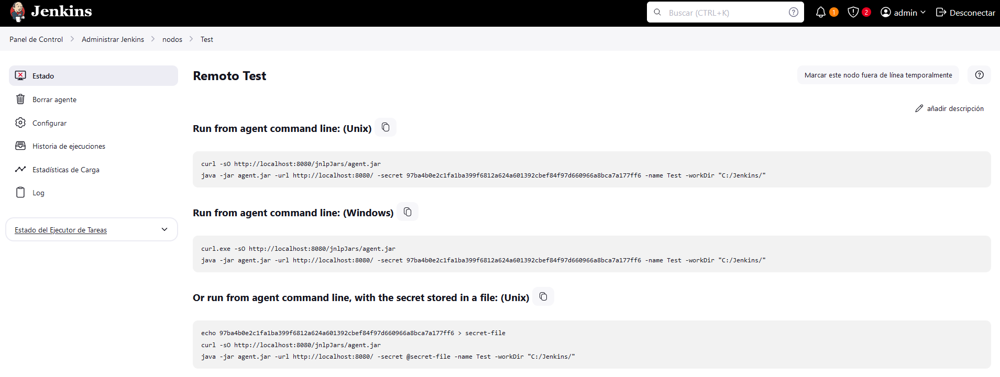

## Instalacion de Jenkins Agent en Windows

1. Configurar Nodo

Tomaremos el comando de Windows ya que sera un agente en Windows

2. Descargar Jar en el server de windows, ejecutando un Powershell ejecutaremos el comando para descargar el .jar, mi caso el siguiente: 
~~~
curl.exe -sO http://localhost:8080/jnlpJars/agent.jar
~~~

Podremos poner el agent.jar en la ruta donde configuramos el nodo

3. Descargar [Winsw](https://github.com/winsw/winsw/releases)

4. Renombraremos el WinSW como "jenkins-agent.exe"

5. En la misma carpeta crearemos el archivo jenkins-agent.xml
~~~XML
<service>
  <id>jenkins-id-agent</id>
  <name>Jenkins</name>
  <description>This service runs Jenkins continuous integration system.</description>
  <env name="JENKINS_HOME" value="%BASE%"/> #Opcional
  <executable>{ACA VAMOS A PONER LA RUTA DE JAVA/BIN}</executable>
  <arguments>-jar agent.jar -url http://localhost:8080/ -secret 97ba4b0e2c1fa1ba399f6812a624a601392cbef84f97d660966a8bca7a177ff6 -name Test -workDir "C:/Jenkins/"</arguments>
  <log mode="roll"></log>
</service>
~~~

6. Una vez teniendo todos esos archivos en una misma carpeta, ejecutaremos
~~~SHELL
jenkinsagent.exe install

jenkinsagent.exe start 
~~~
7. Podremos entrar a Servicios (CTRL + R, services.msc) y encontraremos el servicio "jenkins-id-agent"